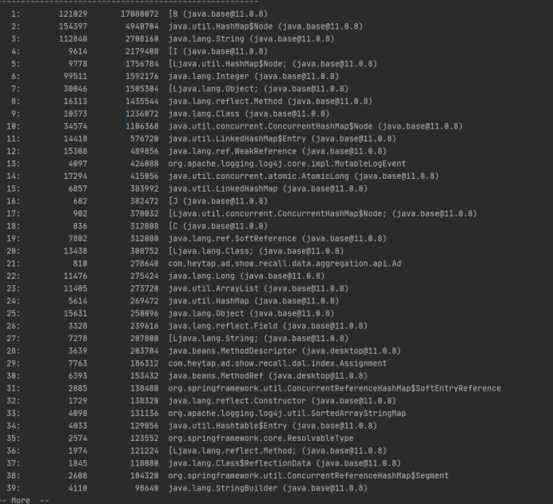
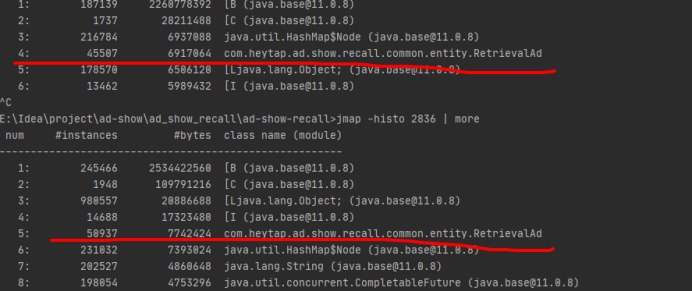

在各个业务调用recall服务的时候，每一次都会copy大量的Ad类型组装成RetrievalAd。
每一次recallrequest，的初次检索可能会有几万个RetrievalAd。导致内存占用过高，
youngGC频繁。但并不是所有业务都要用到RetrevalAd中的每一个参数。
因此可以对这个类进行轻量化处理。

RetrevalAd对象的大小大约为153bytes

如果把所有参数去掉只留下Ad的引用，Retreval对象只有16bytes

如果加上部分feeds中需要的字段则为30bytes~40bytes

目前考虑在RetrevalAd中添加一个类的引用，如果检测到是搜索的广告时再初始化并且

最终提升：

单个RetrievalAd下降至45bytes左右

gc频率下降至2s

10个用户的情况下tps由180+提升至200+

平均耗时下降3ms。