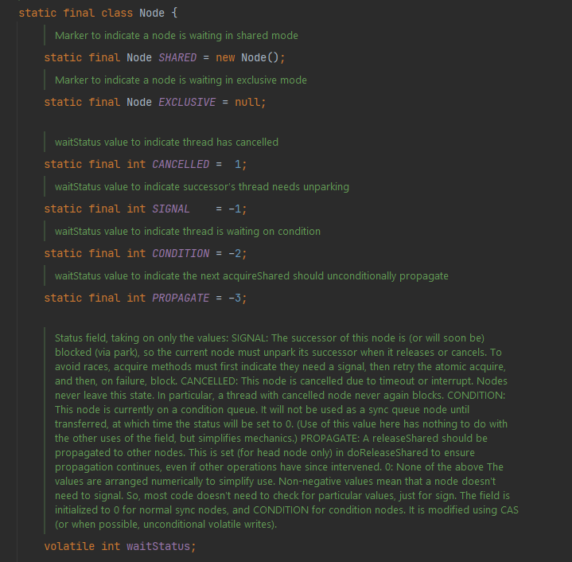
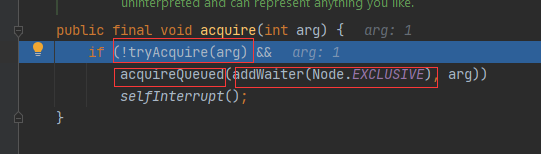

##  AQS源码详细解读

###  什么是AQAS

AQS：AbstractQueuedSynchronizer  ，它是一个**抽象的同步队列器**，这个类位于`java.util.concurrent.locks`包下面，是用来构建锁或者其它同步器组件的重量级基础框架及整个JUC体系的基石，通过内置的FIFO队列来完成资源获取线程的排队工作，并通过一个int类型变量麦示持有锁的状态。

主要是通过CLH队列实现对线程的调度。

CLH: Craig、Landin and Hagersten队列，是一个单向链表，AQS中的队列是CLH变体的虚拟双向队列FIFO。

###  AQS如何实现锁

AQS使用一个volatile的int类型的成员变量来表示同步状态，通过内置的FIFO队列来完成资源获取的排队工作将每条要去抢占资源的线程封装成一个Node节点来实现锁的分配，通过CAS完成对State值的修改。

`node` ：排队获取锁的线程都会生成一个node节点存储在队列里面

`state`: 当前锁的占用状态 为1的是时候表示当前锁被占用

`head`: 指向队列的头节点，头节点是一个空节点

`tail`:指向队列的尾节点

用官方源码注释的图可以看出其结构

###  ReentrantLock

通过ReentrantLock通过debug来看AQS的源码

1：创建两个线程

通过wait变量来控制线程是否占用锁，

通过两个t1,t2,演示对锁lock的获取过程。

2：开始debug

t1开始尝试获取锁，可以看到队列中empty的，没有线程在等待获取锁，此时state=0 表示当前锁没有被占用。

在206行，尝试通过CAS获取锁。

通过逻辑可以知道t1一定可以获取到锁的，获取成功后，把当前`exclusiveOwnerThread`设置为当前线程。

####  t2获取锁

同理，t1占用线程并没有释放锁，此时的state=1的，通过cas获取失败。代码进入到`acquire` 方法中。

继续看acquire方法中的逻辑

这个if语句中有三个 方法，先看`tryAcquire` 方法

这个方法所作的工作就是尝试获取锁，大致逻辑就是`state` 没有被占用，尝试获取锁，如果锁是被占用的，判断当前获取锁的线程和占有所得线程是不是同一个线程，是的话抛出异常。

这里锁是被占用的，所以返回的false。

接下执行方法`addWaiter`

看前面的方法注释，我们也知道这个方法主要就是创建当前线程的Node的节点，同时加入队列中。

可以看到因为当前队列是空的，只有一个t1持有锁，t2在尝试获取锁。队列是空的情况像，会执行`enq`

方法。这个方法会创建一个空的**傀儡节点**。

这个方法的话就是把傀儡节点插入队列中，同时维护头尾指针。

接下来就是执行`acquireQueued`这个方法了。debug进去看看。

接下来如图；

接下来执行的是`shouldParkAfterFailedAcquire`   这个方法，这是方法是AQS的核心。

这个参数一个是当前节点的前节点，一个是当前节点。现在节点的前节点是空的傀儡节点。

前接节点的的`waitStatus`的值为0，所以进入了如图的方法，目的就是修改前节点的值为-1；

修改成功后，继续循环。

这个时候`ws`变成了-1 了返回true

接下来进入

这个方法

就是要当前线程阻塞在这里，安安静静的等待，等待被唤醒。

现在就卡在这里不动了。

那什么时候唤醒呢？

####  线程唤醒

被阻塞在队列中的线程什么时候被唤醒呢？这个需要当前持有锁的线程，解锁的时候唤醒。

获得头节点的下一个节点线程，执行`uppark`操作

这里之前被阻塞的线程被唤醒了

然后继续循环继续抢锁

这里自然就可以抢到锁了。然后把当前节点设置为头节点。

> [AQS源码流程图]: https://www.processon.com/view/link/6092bfe07d9c084071ab659b

