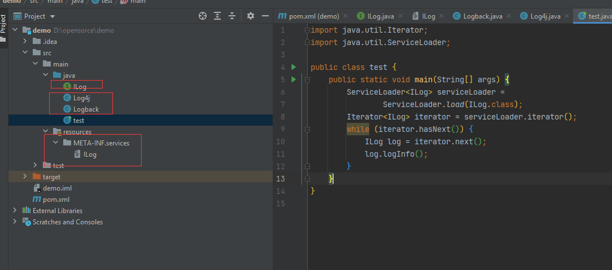
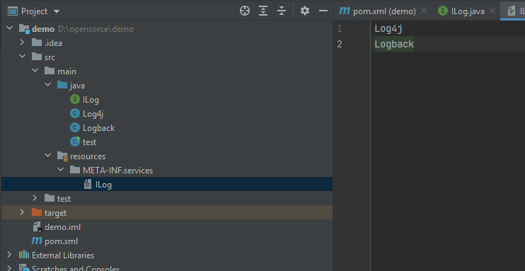
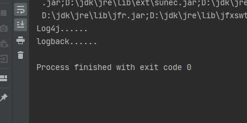
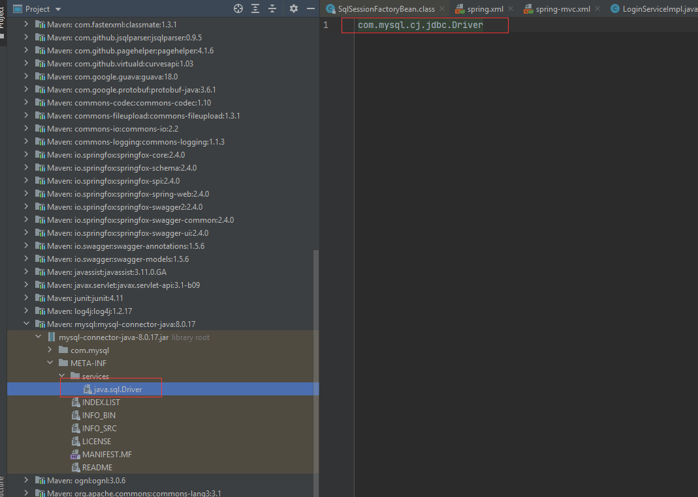

##  Java 的SPI机制

####  什么是java的SPI机制

​	SPI（Service Provider Interface）主要是被框架开发人员使用的一种技术。例如，使用 Java 语言访问数据库时我们会使用到 java.sql.Driver 接口，不同数据库产品底层的协议不同，提供的 java.sql.Driver 实现也不同，在开发 java.sql.Driver 接口时，开发人员并不清楚用户最终会使用哪个数据库，在这种情况下就可以使用 Java SPI 机制在实际运行过程中，为 java.sql.Driver 接口寻找具体的实现。

​	当服务的提供者提供了一种接口的实现之后，需要在 Classpath 下的 META-INF/services/ 目录里创建一个以服务接口命名的文件，此文件记录了该 jar 包提供的服务接口的具体实现类。当某个应用引入了该 jar 包且需要使用该服务时，JDK SPI 机制就可以通过查找这个 jar 包的 META-INF/services/ 中的配置文件来获得具体的实现类名，进行实现类的加载和实例化，最终使用该实现类完成业务功能。

我们简单尝试一下java的SPI机制

- 创建项目

  

创建要给`ILog` 接口，创建两个实现了类 `Logback` ,`Log4j` ,然后实现接口，打印信息

在`resource` 目录下增加要给接口权限定名称作为文件名称，创建一个文件。文件中配置两个实现类的权限定名称



执行Main方法

```java
public static void main(String[] args) {
        ServiceLoader<ILog> serviceLoader =
                ServiceLoader.load(ILog.class);
        Iterator<ILog> iterator = serviceLoader.iterator();
        while (iterator.hasNext()) {
            ILog log = iterator.next();
            log.logInfo();
        }
    }
```

可以看到执行结果：



java就是通过扫码META-INFO/services文件夹目录下面的文件，把实现类加载到servciceLoader里面。


###  JAVA SPI 在JDBC中的使用

​	上面介绍了JAVA的SPI机制，在java的JDBC就是通过SPI机制实现的，java定义了操作数据库的接口  java.sql.Driver，具体的实现不同数据库厂商提供不同的实现。以Mysql为例子。在 mysql-connector-java-*.jar 包中的 META-INF/services 目录下，有一个 java.sql.Driver 文件中只有一行内容，如下所示：



在使用 mysql-connector-java-*.jar 包连接 MySQL 数据库的时候，我们会用到如下语句创建数据库连接：

```java
String url = "jdbc:xxx://xxx:xxx/xxx"; 

Connection conn = DriverManager.getConnection(url, username, pwd); 

```

**DriverManager 是 JDK 提供的数据库驱动管理器**，其中的代码片段，如下所示：

```java
static { 
    loadInitialDrivers(); 
    println("JDBC DriverManager initialized"); 
} 
```

在调用 getConnection() 方法的时候，DriverManager 类会被 Java 虚拟机加载、解析并触发 static 代码块的执行；在 loadInitialDrivers() 方法中通过 JDK SPI 扫描 Classpath 下 java.sql.Driver 接口实现类并实例化，核心实现如下所示：

```java
private static void loadInitialDrivers() { 

    String drivers = System.getProperty("jdbc.drivers") 

    // 使用 JDK SPI机制加载所有 java.sql.Driver实现类 

    ServiceLoader<Driver> loadedDrivers =  

           ServiceLoader.load(Driver.class); 

    Iterator<Driver> driversIterator = loadedDrivers.iterator(); 

    while(driversIterator.hasNext()) { 

        driversIterator.next(); 

    } 

    String[] driversList = drivers.split(":"); 

    for (String aDriver : driversList) { // 初始化Driver实现类 

        Class.forName(aDriver, true, 

            ClassLoader.getSystemClassLoader()); 

    } 

} 

```

在 MySQL 提供的 com.mysql.cj.jdbc.Driver 实现类中，同样有一段 static 静态代码块，这段代码会创建一个 com.mysql.cj.jdbc.Driver 对象并注册到 DriverManager.registeredDrivers 集合中（CopyOnWriteArrayList 类型），如下所示：

```java
static { 

   java.sql.DriverManager.registerDriver(new Driver()); 

} 
```

在 getConnection() 方法中，DriverManager 从该 registeredDrivers 集合中获取对应的 Driver 对象创建 Connection，核心实现如下所示：

```java
private static Connection getConnection(String url, java.util.Properties info, Class<?> caller) throws SQLException { 

    // 省略 try/catch代码块以及权限处理逻辑 

    for(DriverInfo aDriver : registeredDrivers) { 

        Connection con = aDriver.driver.connect(url, info); 

        return con; 

    } 

} 
```

