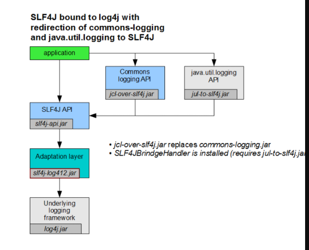
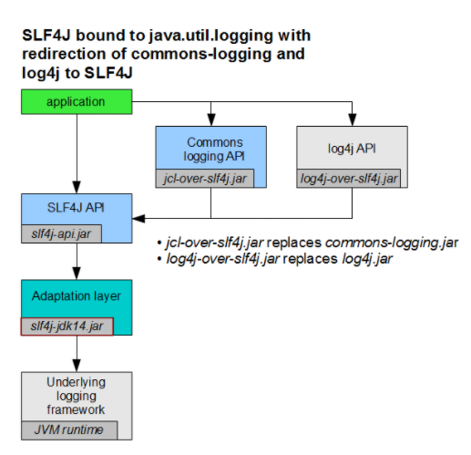

###  JAVA日志和Springboot日志集成


1：java的日志生态中又很多日志实现框架，比如：

- [JUL](https://docs.oracle.com/javase/7/docs/api/java/util/logging/package-summary.html) 
- [Apache Log4j1](https://logging.apache.org/log4j/1.2/)
- [Apache Log4j2](https://logging.apache.org/log4j/2.x/)
- [Logback](http://logback.qos.ch/)

但是我们在项目中引入很多包，很多包的日志打印的框架不一样，这样会导致我们要配置很多日志的配置文件，

但是java又日志接口，对日志接口进行了规范，这些日志具体实现框架就可以在统一的接口下进行实现。这也就是门面模式。

现在常用的日志门面有

- [SLF4J](http://www.slf4j.org/)
- [JCL](https://commons.apache.org/proper/commons-logging/)
- [jboss-logging](https://github.com/jboss-logging)

但是同样有三种门面，比如在spring采用的是`JCL` ，Hibernate 采用是`jboss-logging`同样在项目中面对不同的日志框架适配问题。

​	这里我们说明下现在主流的日志模式：**SLF4J 作为日志门面框架，Logback 作为日志实现框**，来举例适配一下，具体在[《SLF4J 文档 —— Bridging legacy APIs》](http://www.slf4j.org/legacy.html)有详细说明。

 这是SLF4J+Logback


从图中可以看到，通过引入对应的转换包将日志日志框架转换到SLF4J+Logback模式。

- [`jcl-over-slf4j`](https://mvnrepository.com/artifact/org.slf4j/jcl-over-slf4j) :将调用 JCL 打日志的地方，适配成调用 SLF4J API
- [`log4j-over-slf4j`](https://mvnrepository.com/artifact/org.slf4j/log4j-over-slf4j):将调用 Log4j1 打日志的地方，适配成调用 SLF4J API
- [`jul-over-slf4j`](https://mvnrepository.com/artifact/org.slf4j/jul-to-slf4j):将调用 JUL 打日志的地方，适配成调用 SLF4J API


同理看文档中对：SLF4J+log4j2




[`slf4j-log4j2`](https://mvnrepository.com/artifact/org.slf4j/slf4j-log4j12) 库：实现对slf4j日志的实现



## springboot日志框架的集成

springboot集成对starter：

- **1:SLF4J + Logback :[`spring-boot-starter-logging`](https://mvnrepository.com/artifact/org.springframework.boot/spring-boot-starter-logging)**

starter的pom文件依赖：

  ```xml
<dependencies>
<dependency>
	<groupId>ch.qos.logback</groupId>
	<artifactId>logback-classic</artifactId>
</dependency>
<dependency>
	<groupId>org.apache.logging.log4j</groupId>
	<artifactId>log4j-to-slf4j</artifactId>
</dependency>
<dependency>
	<groupId>org.slf4j</groupId>
	<artifactId>jul-to-slf4j</artifactId>
</dependency>
</dependencies>
  ```

这个符合前面说的适配依赖说明

- **2: SLF4J + Log4j2 :[`spring-boot-starter-log4j2`](https://mvnrepository.com/artifact/org.springframework.boot/spring-boot-starter-log4j2)**

```xml
<dependencies>
	<dependency>
		<groupId>org.apache.logging.log4j</groupId>
		<artifactId>log4j-slf4j-impl</artifactId>
	</dependency>
	<dependency>
		<groupId>org.apache.logging.log4j</groupId>
		<artifactId>log4j-core</artifactId>
	</dependency>
	<dependency>
		<groupId>org.apache.logging.log4j</groupId>
		<artifactId>log4j-jul</artifactId>
	</dependency>
	<dependency>
		<groupId>org.slf4j</groupId>
		<artifactId>jul-to-slf4j</artifactId>
	</dependency>
</dependencies>
```


以SLF4J+log4j2 作为项目的日志框架

1：引入**2: SLF4J + Log4j2 :[`spring-boot-starter-log4j2`](https://mvnrepository.com/artifact/org.springframework.boot/spring-boot-starter-log4j2)** starter

2：在项目`resource`目录下添加配置文件`log4j2-spring.xml`

```xml
<?xml version="1.0" encoding="UTF-8"?>
<Configuration status="WARN">
    <Properties>
        <Property name="PID">????</Property>
        <Property name="LOG_EXCEPTION_CONVERSION_WORD">%xwEx</Property>
        <Property name="LOG_LEVEL_PATTERN">%5p</Property>
        <Property name="LOG_DATEFORMAT_PATTERN">yyyy-MM-dd HH:mm:ss.SSS</Property>
        <!-- 1.1 -->
        <Property name="FILE_LOG_BASE_PATH">/Users/yunai/logs</Property>
        <Property name="APPLICATION_NAME">demo-application</Property>

        <!-- 1.2 -->
        <!-- 控制台的日志格式 -->
        <Property name="CONSOLE_LOG_PATTERN">%clr{%d{${LOG_DATEFORMAT_PATTERN}}}{faint} %clr{${LOG_LEVEL_PATTERN}} %clr{${sys:PID}}{magenta} %clr{---}{faint} %clr{[%15.15t]}{faint} %clr{%-40.40c{1.}}{cyan} %clr{:}{faint} %m%n${sys:LOG_EXCEPTION_CONVERSION_WORD}</Property>
        <!-- 1.3 -->
        <!-- 日志文件的日志格式 -->
        <Property name="FILE_LOG_PATTERN">%d{${LOG_DATEFORMAT_PATTERN}} ${LOG_LEVEL_PATTERN} ${sys:PID} --- [%t] %-40.40c{1.} : %m%n${sys:LOG_EXCEPTION_CONVERSION_WORD}</Property>
    </Properties>

    <Appenders>
        <!-- 2.1 -->
        <!-- 控制台的 Appender -->
        <Console name="Console" target="SYSTEM_OUT" follow="true">
            <PatternLayout pattern="${sys:CONSOLE_LOG_PATTERN}" />
        </Console>

        <!-- 2.2 -->
        <!-- 日志文件的 Appender -->
        <RollingFile name="File" fileName="${FILE_LOG_BASE_PATH}/${sys:APPLICATION_NAME}"
                     filePattern="${FILE_LOG_BASE_PATH}/${sys:APPLICATION_NAME}-%d{yyyy-MM-dd-HH}-%i.log.gz">
            <!-- 日志的格式化 -->
            <PatternLayout>
                <Pattern>${sys:FILE_LOG_PATTERN}</Pattern>
            </PatternLayout>
            <!--滚动策略，基于时间 + 大小的分包策略 -->
            <Policies>
                <SizeBasedTriggeringPolicy size="10 MB" />
            </Policies>
        </RollingFile>
    </Appenders>

    <Loggers>
        <!-- 3.1 -->
        <!-- 常用组件的 Logger 的日志级别 -->
        <Logger name="org.apache.catalina.startup.DigesterFactory" level="error" />
        <Logger name="org.apache.catalina.util.LifecycleBase" level="error" />
        <Logger name="org.apache.coyote.http11.Http11NioProtocol" level="warn" />
        <logger name="org.apache.sshd.common.util.SecurityUtils" level="warn"/>
        <Logger name="org.apache.tomcat.util.net.NioSelectorPool" level="warn" />
        <Logger name="org.eclipse.jetty.util.component.AbstractLifeCycle" level="error" />
        <Logger name="org.hibernate.validator.internal.util.Version" level="warn" />
        <logger name="org.springframework.boot.actuate.endpoint.jmx" level="warn"/>

        <!-- 3.2 -->
        <!-- 自定义的 Logger 的日志级别 -->
        <logger name="cn.iocoder.springboot.lab37.loggingdemo" level="debug"/>

        <!-- 3.3 -->
        <!-- 设置 Appender ，同时 ROOT 的日志级别为 INFO -->
        <Root level="info">
            <AppenderRef ref="Console" />
            <AppenderRef ref="File" />
        </Root>
    </Loggers>
</Configuration>
```


同样在配置SLF4j+logback也是一样

1：引入[`spring-boot-starter-logging`](https://mvnrepository.com/artifact/org.springframework.boot/spring-boot-starter-logging)到pom.xml文件中

2：添加配置文件[`logback-spring.xml`](https://github.com/YunaiV/SpringBoot-Labs/blob/master/lab-37/lab-37-logging-logback/src/main/resources/logback-spring.xml)

```java
<?xml version="1.0" encoding="UTF-8"?>

<configuration>

    <!-- <1> -->
    <!-- 引入 Spring Boot 默认的 logback XML 配置文件  -->
    <include resource="org/springframework/boot/logging/logback/defaults.xml"/>

    <!-- <2.1> -->
    <!-- 控制台 Appender -->
    <appender name="console" class="ch.qos.logback.core.ConsoleAppender">
        <!-- 日志的格式化 -->
        <encoder>
            <pattern>${CONSOLE_LOG_PATTERN}</pattern>
            <charset>utf8</charset>
        </encoder>
    </appender>

    <!-- 2.2 -->
    <!-- 从 Spring Boot 配置文件中，读取 spring.application.name 应用名 -->
    <springProperty name="applicationName" scope="context" source="spring.application.name" />
    <!-- 日志文件的路径 -->
    <property name="LOG_FILE" value="/Users/yunai/logs/${applicationName}.log"/>​
    <!-- 日志文件 Appender -->
    <appender name="file" class="ch.qos.logback.core.rolling.RollingFileAppender">
        <file>${LOG_FILE}</file>
        <!--滚动策略，基于时间 + 大小的分包策略 -->
        <rollingPolicy class="ch.qos.logback.core.rolling.SizeAndTimeBasedRollingPolicy">
            <fileNamePattern>${LOG_FILE}.%d{yyyy-MM-dd}.%i.gz</fileNamePattern>
            <maxHistory>7</maxHistory>
            <maxFileSize>10MB</maxFileSize>
        </rollingPolicy>
        <!-- 日志的格式化 -->
        <encoder>
            <pattern>${FILE_LOG_PATTERN}</pattern>
            <charset>utf8</charset>
        </encoder>
    </appender>

    <!-- 3.1 -->
    <!-- 测试环境，独有的配置 -->
    <springProfile name="dev">
        <!-- 设置 Appender -->
        <root level="INFO">
            <appender-ref ref="console"/>
        </root>

        <!-- 设置 "cn.iocoder.springboot.lab37.loggingdemo" 的 Logger 的日志级别为 DEBUG -->
        <logger name="cn.iocoder.springboot.lab37.loggingdemo" level="DEBUG"/>
    </springProfile>

    <!-- 3.2 -->
    <!-- 生产环境，独有的配置 -->
    <springProfile name="prod">
        <!-- 设置 Appender -->
        <root level="INFO">
            <appender-ref ref="console"/>
            <appender-ref ref="file"/>
        </root>
    </springProfile>

</configuration>
```

