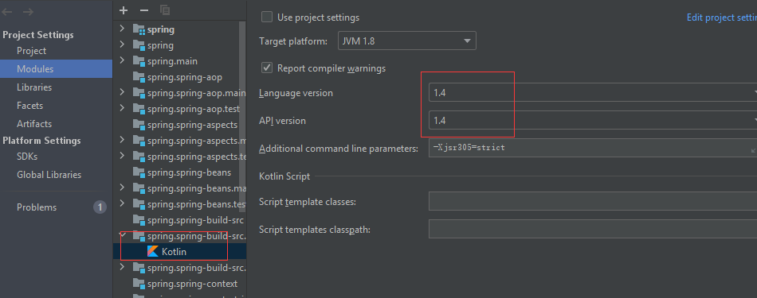
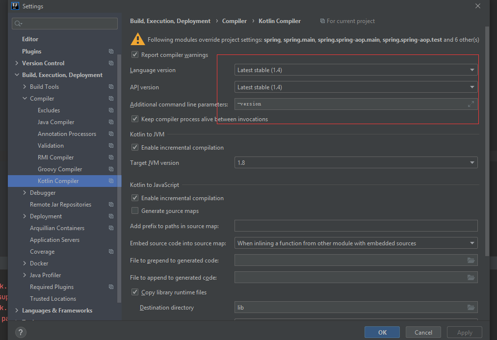
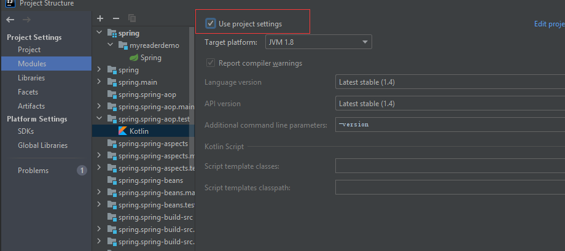

#  Spring的源码搭建

**问题一：Kotlin: Language version 1.1 is no longer supported; please, use version 1.2 or greater.**

​	1：这个就是Kotlin语言版本太低了，看看报错的是那个模块在idea中，调整一下编译的等级

2：可以设置全局的Kotlin编译等级，然后每个模块设置使用project settings

然后每个模块设置使用project settings

